# Enterprise Governance Baseline and Inventory

## Scope and Evidence

This document records the repository state observed on 2026-07-13 before the
enterprise-governance phases begin. It is an implementation baseline, not a
claim of certification, regulatory approval, or legal compliance.

Baseline revision: `e308fdf6`. Candidate implementation evidence is recorded
separately in `implementation-ledger.md` and
`14-final-implementation-report.md`; the pipeline inventory below intentionally
describes the pre-change baseline.

Evidence sources were the current worktree, the existing architecture, threat,
deployment, policy, provider, and refactor documents, and direct inspection of
the production composition path and its boundary crates.

## Environment

| Item | Observed value |
| --- | --- |
| Repository | `/home/test-user/IdeaProjects/prodex` |
| Date and time zone | 2026-07-13, Asia/Jakarta |
| Kernel | Linux 6.17.0-35-generic x86_64 |
| Rust | `rustc 1.97.0 (2d8144b78 2026-07-07)` |
| Cargo | `cargo 1.97.0 (c980f4866 2026-06-30)` |
| Node.js | `v24.18.0` |
| npm | `12.0.1` |

The later candidate run captured pure-stage inspection, PDP and governed-routing
microbenchmarks plus the compatible proxy baseline in
`12-performance-baseline-and-results.md`. Allocation, queue/lock wait,
end-to-end governed overhead and the disabled compatibility delta remain
pending.

## Current Data-Plane Pipeline

The dedicated gateway and compatibility runtime converge in the
`prodex-app` local-rewrite pipeline. The current production sequence is:

```mermaid
flowchart LR
    Client[CLI or HTTP client] --> HTTP[Canonical HTTP target]
    HTTP --> Auth[Credential authentication and scope authorization]
    Auth --> Admission[Bounded local admission]
    Admission --> WS{WebSocket dispatch?}
    WS -->|Gemini Live| Live[Provider-specific live handler]
    WS -->|HTTP| Body[Bounded body capture]
    Body --> Presidio[Optional Presidio redaction]
    Presidio --> Guardrail[Keyword, model, prompt, PII, and webhook guardrails]
    Guardrail --> Reserve[Virtual-key and usage reservation]
    Reserve --> Constraints[Request constraints]
    Constraints --> Provider[Provider adapter and transport]
    Provider --> Response[Response normalization, keyword/webhook guardrails, reconciliation]
```

The typed path already supplies:

- canonical route and plane classification in `prodex-gateway-http`;
- authentication evidence in `prodex-authn`;
- RBAC, credential-scope, and tenant authorization in `prodex-authz` and
  `prodex-domain`;
- application request-context and data-plane plans in `prodex-application`;
- reservation, provider invocation, and trace plans in `prodex-gateway-core`;
- bounded provider invocation and retry contracts in `prodex-provider-spi`;
- transport, continuation affinity, and pre-commit retry behavior in the
  runtime proxy crates.

Important compatibility exceptions remain. Anonymous compatibility admission
can construct a provider invocation without a tenant-bound principal, and the
Gemini Live WebSocket branch dispatches before body capture and current
inspection. The typed application admission plan does not yet contain an
inspection result, data classification, policy decision, obligations, or a
mandatory data-plane audit plan.

## Current Control-Plane Pipeline

```mermaid
flowchart LR
    Admin[Admin HTTP or control-plane CLI] --> Route[Canonical control-plane route]
    Route --> Identity[Admin token, SSO, or OIDC evidence]
    Identity --> Authorization[Application and control-plane authorization]
    Authorization --> Mutation[Typed mutation plan]
    Mutation --> Preconditions[Idempotency and revision preconditions]
    Preconditions --> Audit[Append-only audit plan]
    Audit --> Store[File, SQLite, or PostgreSQL adapter]
    Store --> Publication[Configuration publication and cache invalidation where applicable]
```

`prodex-control-plane` defines typed operations, resource requirements,
break-glass checks, and mandatory success/denial audit requirements.
`prodex-application` composes authorization, idempotency, preconditions, audit,
and storage plans for existing administrative mutations. Revisioned generic
configuration publication and last-known-good cache decisions exist in
`prodex-config`, `prodex-domain`, and `prodex-application`.

There is no policy draft/submit/approve/activate/rollback workflow. A currently
authorized administrator can publish supported configuration directly; no
maker-checker separation, quorum, approval expiry, or execution approval state
machine is present.

## Inventory

### Ingress and request shapes

- `prodex-cli` owns CLI parsing. `prodex-app` launches Codex, Claude-compatible,
  Gemini CLI, and gateway/runtime flows.
- `prodex-gateway-server`, `prodex-gateway-http`, and the dedicated
  `prodex-gateway` binary own the bounded HTTP front and canonical routes.
- Data-plane routes include Responses, remote compact, chat completions,
  Anthropic messages, embeddings, model endpoints, and supported WebSocket
  routes. Unary, SSE, and provider-specific streaming paths exist.
- Control-plane routes cover gateway administration, identity and virtual-key
  operations, budget/billing, audit query/export/retention, route explanation,
  and configuration publication surfaces.
- The app-server broker remains a compatibility/preview surface. The npm
  gateway SDK is a client surface, not evidence that every IDE or machine
  channel already reaches a governed pipeline.

### Providers and execution

`prodex-provider-core` and `prodex-provider-spi` expose typed provider contracts,
capabilities, transformations, error classification, retry stages, and
conformance fixtures for:

- OpenAI;
- Anthropic;
- Copilot;
- DeepSeek;
- Gemini;
- Kiro;
- local/OpenAI-compatible endpoints.

Provider capability support is explicit and may be native, translated,
passthrough, degraded, rejected, or unsupported. The current runtime still owns
live transport, provider credentials, quota rotation, health, affinity, and
fallback. There is no revisioned tenant provider registry or compliance-first
hard-filter and deterministic soft-score governance planner.

### Session and continuation state

- `prodex-session-store` owns persisted session metadata helpers.
- Runtime state preserves `previous_response_id`, `x-codex-turn-state`, and
  session/profile bindings, including session-scoped compact affinity.
- Retry and rotation remain bounded to pre-commit stages; mid-stream rotation
  is prohibited by existing runtime contracts.
- Governance classification, policy revision pinning, credential-scope binding,
  absolute/idle timeout, revocation, and concurrent-session policy are not yet
  represented together in one governed session context.

### Inspection and guardrails

- `prodex-presidio` is an external analyzer/anonymizer adapter with bounded HTTP
  timeout, response-size handling, endpoint syntax validation, and redacted
  errors.
- `prodex-app` owns the live Presidio calls and JSON field walk. It inspects a
  fixed set of string field names and can operate on HTTP and legacy proxy
  WebSocket text when explicitly enabled.
- `prodex-redaction` and `prodex-runtime-proxy` independently implement local
  secret, email, long-number, and sensitive-key redaction.
- Runtime guardrails also implement model allow-lists, keyword blocking,
  prompt-injection signals, pre/post webhooks, and bounded streaming keyword
  matching.

The inspection boundary is not yet singular. Presidio and local PII redaction
can both mutate the request, their policy remains in `prodex-app` and runtime
configuration, non-UTF-8 bodies can bypass Presidio, and current findings are
discarded after masking. There is no typed inspection coverage, bounded finding
model, detector revision, classification, or deterministic masking obligation.
Endpoint validation does not yet enforce an enterprise/bank trusted or on-prem
inspection allow-list.

### Policy and configuration

- `policy.toml` is parsed and validated by `prodex-runtime-policy`.
- Runtime policy contains identity, state, route, request-constraint,
  observability, secret-reference, virtual-key, and guardrail configuration.
- Signed/digested policy snapshots, activation state, invalidation, refresh
  windows, and last-known-good selection primitives exist.
- Generic configuration publication has tenant/revision checks, audit planning,
  cache activation, and publication delivery staging.

This is configuration and runtime guardrail policy, not the required PDP. The
repository has no strongly typed `PolicyInput`, allow/deny/require-approval
decision, obligation merge, deterministic rule compiler/evaluator, deployment
modes (`personal`, `enterprise_observe`, `enterprise_enforce`, `bank_enforce`),
or tenant-scoped rollout state.

### Audit and observability

- `prodex-domain` defines bounded audit events, digests, envelopes, query,
  export, retention, legal-hold, and chain-link verification primitives.
- `prodex-storage`, `prodex-storage-postgres`, and `prodex-storage-sqlite`
  provide tenant-scoped append/query/export/purge plans. PostgreSQL includes
  Row-Level Security for the current audit table.
- `prodex-observability` provides low-cardinality audit, chain, query, and
  retention metric plans.
- Existing control-plane application plans require append-only hash-chain audit
  for authorized and denied actions.
- Live data-plane and compatibility handlers also write a separate filesystem
  JSON audit log through `prodex-audit-log`.

The live data-plane logger is a parallel audit path, is not hash chained, and
some callers intentionally discard append failures. Current durable audit rows
do not carry the complete governance metadata required for policy revision,
classification, routing revision, provider decision, request ID, and trace ID.
There is no transactional SIEM outbox, idempotent exporter, bounded retry,
dead-letter path, or bank-mode mandatory-audit failure matrix.

### Storage and secrets

- PostgreSQL is the production durable boundary for tenant, identity, keys,
  budgets, reservations, usage ledger, idempotency, and audit records. Current
  migrations enable tenant RLS.
- SQLite is the local/single-node compatibility durable boundary.
- Redis is used for rebuildable rate limiting, caching, and coordination, not
  authoritative billing state.
- File-backed compatibility stores remain in the composition root.
- `SecretRef` and projected external-secret providers exist; provider
  invocation carries references rather than raw credentials.

Missing Phase 3 storage includes immutable policy revisions, active and
last-known-good pointers, approval and activation history, classification rule
revisions, execution approvals, and the SIEM outbox/dead-letter tables.

## Phase 1-3 Gaps

| Phase | Current gap |
| --- | --- |
| Phase 1 | No implementation ledger or complete channel/schema inventory before this document; two request-redaction paths; incomplete route coverage; no typed findings/coverage/revision; insufficient detector, pattern, nesting, match, timeout, concurrency, and trusted-endpoint controls; required adversarial, load, compatibility, and no-content tests are incomplete. |
| Phase 2 | No four-level data classification, monotonic session classification, versioned classification rules, typed request/response obligations, structured response inspection, or required unary/SSE/WebSocket and observe/enforce matrix. |
| Phase 3 | No deterministic PDP/PIP/PEP contract, RBAC/ABAC policy input, revisioned durable policy store, maker-checker approval, execution approval, complete governance audit schema, mandatory-audit failure handling, or durable SIEM outbox. |

## Baseline Commands and Results

Commands in this section are reported only when actually executed by the named
evidence source.

| Command | Result | Evidence source |
| --- | --- | --- |
| `rtk git status --short` | Pass; no output, worktree clean at audit start | This baseline audit |
| `rtk cargo test -q -p prodex-domain -p prodex-presidio -p prodex-application -p prodex-control-plane -p prodex-gateway-core -p prodex-storage -p prodex-storage-sqlite -p prodex-storage-postgres` | Pass; 784 tests across 50 suites | This baseline audit |
| `cargo test --locked --workspace --all-features` | Pre-existing failure; two concurrent cache-stat assertions | Root-agent baseline evidence; not rerun by this audit |

The focused pass proves only the listed crates and tests. It does not prove the
enterprise-governance specification, the full workspace, external services,
migrations, load behavior, or deployment readiness.
