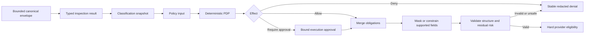

# Classification and Obligations

## Scope and Status

This document defines the Phase 2 classification and obligation contract and
records how much of it is in the production path as of 2026-07-13. It is not a
certification claim.

The repository has typed bounded request inspection, monotonic four-level
classification, revisioned classification-rule snapshots, typed policy
decisions, deterministic obligation conflict resolution, and obligation-driven
response enforcement. Migrated HTTP, SSE, and supported WebSocket paths carry
that plan through application admission and provider dispatch.

## Current Production Evidence

| Capability | Status | Repository evidence |
| --- | --- | --- |
| Ordered `Public`, `Internal`, `Confidential`, `Restricted` model | Implemented | `prodex-domain::DataClassification` and `raised_to` |
| Conservative `Full`, `Partial`, `Unsupported` coverage | Implemented | `prodex-domain::InspectionCoverage::combine` |
| Content-free typed findings | Implemented | `FindingKind`, `ContentLocation`, `InspectionFinding`, and redacted `Debug` implementations |
| Bounded detector output | Implemented | At most 8 sources, 256 findings, 32 tags, 32 reasons, 128-byte metadata tokens, and 256-byte paths |
| Finding-to-minimum-classification mapping | Implemented | PII and tenant-sensitive findings raise to `Confidential`; credentials, government IDs, cards, and accounts raise to `Restricted` |
| Trusted and prior classification raising | Implemented in the pure application planner | `plan_application_request_inspection` takes optional trusted and prior classifications and only raises |
| Request-path propagation | Implemented for migrated local rewrite HTTP and text WebSocket paths | The inspection plan reaches application admission and provider dispatch; coverage, classification, and finding count are logged without match content |
| Versioned compiled classification rules and checksum | Implemented | Tenant-scoped immutable classification artifacts compile to revision/checksum-bound snapshots with activation, rollback, and LKG loading |
| Route, capability, tenant, session, and risk rules | Implemented | The application planner evaluates typed classification requests against the active compiled snapshot and carries session and environment context |
| Authorized declassification operation | Planned | No production lowering path exists, which is safe but incomplete operationally |
| Typed request and response obligations | Implemented | The PDP returns typed masking, response-inspection, coverage, modality, provider, and output-limit obligations enforced by the application/runtime boundary |
| Observe/enforce/bank decision modes | Implemented | Personal, enterprise-observe, enterprise-enforce, and bank-enforce modes have typed failure behavior and validation |

The current runtime defaults migrated requests to `Internal`. It does not use
an `Unknown` routeable placeholder and it cannot lower a prior classification.
Those properties combine with revisioned rules and policy-owned obligations in
the production application boundary.

## Classification Contract

The target output extends the current inspection result without putting raw
content into governance metadata:

```rust
pub struct ClassificationDecision {
    pub classification: DataClassification,
    pub coverage: InspectionCoverage,
    pub reason_codes: BoundedReasonCodes,
    pub detector_revision: DetectorRevisionId,
    pub rule_revision: ClassificationRuleRevisionId,
    pub rule_checksum: RevisionChecksum,
}
```

The active rule artifact is immutable and compiled before publication:

```yaml
revision: classification-2026-07-13-01
default: internal
limits:
  max_rules: 256
  max_reasons: 32
rules:
  - id: credential-material
    finding_kinds: [access_token, api_key, private_key, password]
    raise_to: restricted
  - id: unsupported-sensitive-modality
    coverage: unsupported
    requested_modalities: [image, audio, file]
    raise_to: confidential
```

The example is a publication format, not evidence that a parser or store is
already implemented. Publication must reject unknown fields, duplicate IDs,
invalid enum values, excessive collections, invalid checksums, contradictory
rules, and rules whose evaluation cost exceeds configured bounds. A rejected
candidate cannot replace the last-known-good snapshot.

## Deterministic Classification Algorithm

The request path consumes only an already validated immutable snapshot. It
does not compile patterns, query storage, or call a network service.

```text
level = tenant default
level = max(level, prior session/context classification)
level = max(level, authorized trusted-source label)

for each normalized finding in deterministic order:
    level = max(level, minimum classification for finding kind)
    add bounded stable reason

for each matching compiled rule in stable rule-ID order:
    level = max(level, rule.raise_to)
    add bounded stable reason

return level + coverage + revisions + sorted/deduplicated reasons
```

Inputs include detector findings, coverage, trusted source labels, canonical
route/action, requested capabilities and modalities, tenant rules, channel and
credential scope, prior session classification, and bounded prompt-injection
or tool-execution risk signals. Channel and provider aliases are attributes;
they cannot bypass classification.

Classification is a join operation over the ordered levels, so input order
cannot lower the result. An untrusted request label is ignored for lowering and
may be accepted only as a request to raise. Declassification is a distinct
control-plane action requiring authorization, maker-checker policy where
configured, an exact revision, an expiry, and mandatory content-free audit.

## Obligation Schema

The PDP returns bounded typed obligations. Adapters may execute protocol
translations, but they do not invent or weaken obligations.

```rust
pub enum RequestObligation {
    MaskFindings(BoundedFindingKinds),
    DenyIfCoverageBelow(InspectionCoverageFloor),
    RequireProviderTrust(ProviderTrustTier),
    RequireLocalExecution,
    AllowProviders(BoundedProviderIds),
    DenyProviders(BoundedProviderIds),
    AllowRegions(BoundedRegions),
    ProhibitRetention,
    ProhibitTrainingUse,
    AllowTools(BoundedToolIds),
    DisableTools,
    AllowModels(BoundedModelIds),
    AllowModalities(BoundedModalities),
    LimitInputTokens(u32),
    LimitOutputTokens(u32),
    LimitContextTokens(u32),
    RequireExecutionApproval,
    DenyFallbackOutsideComplianceSet,
}

pub enum ResponseObligation {
    Inspect,
    MaskFindings(BoundedFindingKinds),
    DenyFindings(BoundedFindingKinds),
    InspectToolCalls,
    InspectToolResults,
    LimitOutputTokens(u32),
    RetainFor(BoundedRetention),
    DeleteBy(BoundedDeletionDeadline),
}

pub struct ObligationSet {
    pub request: BoundedRequestObligations,
    pub response: BoundedResponseObligations,
    pub audit_detail: AuditDetailLevel,
    pub session: SessionObligations,
}
```

The complete policy decision also carries `Allow`, `Deny`, or
`RequireApproval`, stable reasons, policy revision, and expiry. Raw prompts,
matches, tool arguments, and model output are not fields in the decision.

## Conflict Resolution

Obligation merging is deterministic and can only preserve or strengthen a
constraint:

| Obligation kind | Merge rule |
| --- | --- |
| Policy effect | Explicit `Deny` wins; otherwise `RequireApproval` wins over `Allow` |
| Allowed providers, regions, models, tools, modalities | Set intersection |
| Denied providers or capabilities | Set union, then subtract from the allowed set |
| Provider trust floor | Maximum required tier |
| Local execution, response inspection, no retention/training, no out-of-set fallback | Logical OR |
| Input, output, context, retention, and deletion caps | Strictest valid minimum |
| Finding masks and denies | Union by finding kind; deny wins where masking cannot meet residual-risk policy |
| Session re-authentication/MFA strength | Strongest requirement |
| Audit detail | Strongest approved content-free level |

An empty required allow-set, an impossible trust/region combination, an
overflow, an unknown obligation, or a masking conflict becomes a stable denial;
it never becomes an implicit allow. The evaluator emits only bounded reason
codes and a bounded normalized obligation set.

## Request Enforcement Flow



Masking applies only to schema locations identified by validated findings and
selected by policy. Replacements are ordered, non-overlapping, deterministic
within the request, and structure preserving. If the mask would corrupt JSON,
tool semantics, or leave unacceptable residual risk, enforcement denies rather
than guessing.

The current Presidio path performs anonymization before a PDP exists. It is a
migration safety layer, not the final obligation executor. The legacy local PII
redactor now acts only as a fallback when typed inspection coverage is
`Unsupported`; it must be removed as an authoritative policy path after all
supported schemas converge.

## Bounded Hot-Path Rules

Existing limits remain hard ceilings unless a lower published tenant limit is
active:

| Item | Current ceiling | Required Phase 2 behavior |
| --- | ---: | --- |
| Detector sources | 8 | Reject excess before aggregation |
| Findings | 256 | Reject or apply mode failure policy; never report truncated `Full` coverage |
| Tags | 32 | Sort, deduplicate, and reject excess |
| Reason codes | 32 | Stable, bounded, sorted, and deduplicated |
| Metadata token | 128 bytes | ASCII-safe validated identifier |
| Content location path | 256 bytes | Schema path or wildcard only; no raw argument keys |
| JSON nesting | 32 levels | Stable inspection-limit failure |
| Inspectable JSON values | 256 | Stable inspection-limit failure |
| Inspectable JSON text | 1 MiB | Stable inspection-limit failure |
| Classification rules | 128 | Reject excess during rule-set compilation; evaluation is bounded by the compiled snapshot |
| Obligations and set members | 64 per rule/merged decision | Reject excess before activation; selector-derived allow/deny sets share the same finite ceiling |

All stage deadlines derive from the request deadline. Classification and
obligation merge are side-effect-free and network-free. Detector calls remain
separately bounded and measured.

## Failure Matrix

| Mode | Missing/invalid classification snapshot | Partial or unsupported required inspection | Contradictory or unknown obligation | Masking cannot preserve semantics |
| --- | --- | --- | --- | --- |
| `personal` | Preserve documented compatibility when governance is off; enabled enforcement follows its policy | Never claim `Full`; existing compatibility may continue when off | Reject candidate configuration | Deny only when enforcement is enabled |
| `enterprise_observe` | Keep LKG and record bounded shadow failure | Shadow constraint/denial; authoritative legacy behavior remains unchanged | Reject candidate revision; keep LKG | Record would-deny evidence without exposing content |
| `enterprise_enforce` | Use verified LKG or deny | Deny or constrain to an explicitly eligible approved provider | Deny request | Deny request |
| `bank_enforce` | Fail closed | Fail closed except an explicitly approved constrained local path | Fail closed | Fail closed |

Observe mode cannot override an existing authentication, authorization,
provider, secret, or guardrail denial. A kill switch selects a verified LKG or
stops affected traffic; it does not disable mandatory bank controls.

## Verification and Exit Evidence

Current focused tests prove:

- classification ordering and conservative coverage combination;
- rejection of classification below a finding's minimum;
- finding, source, tag, and reason bounds;
- deterministic sorting/deduplication and content-free debug output;
- monotonic combination of default, trusted, prior, and finding-derived levels;
- explicit `Unsupported` coverage when no detector evidence exists;
- propagation of the inspection plan through application admission.

Phase 2 still requires table-driven and property/fuzz evidence for all four
classifications, all three coverage states, trusted/untrusted labels, rule
snapshot activation/LKG/rollback, obligation conflict resolution, structured
masking, every canonical request schema, tools, modalities, local/remote
providers, and observe/enforce/bank behavior.

The classification-and-obligation exit gate is not met until:

1. every routed request has explicit coverage, classification, detector and
   classification-rule revisions, and a policy decision;
2. one typed obligation executor is authoritative before provider eligibility;
3. no channel, compatibility route, adapter, or alias bypasses the same merge
   semantics;
4. revision publication, activation, rollback, and LKG failure tests pass; and
5. the full matrix and bounded performance evidence are recorded in the
   implementation ledger.
