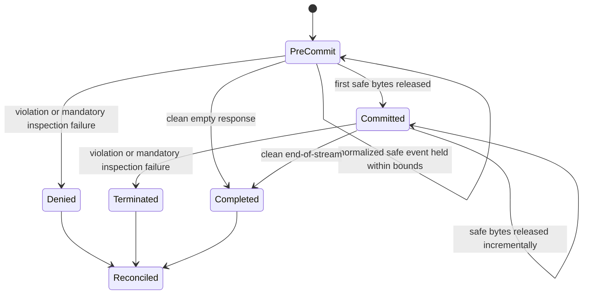

# Response and Stream Enforcement

## Scope and Status

This document records the Phase 2 response policy-enforcement point for unary,
SSE, and supported WebSocket output. Typed, classification-aware obligations
now drive coverage checks, masking, output bounds, pre-commit denial, and
post-commit termination without weakening affinity or no-mid-stream rotation.

## Current Production Evidence and Gaps

| Path | Current behavior | Remaining gap |
| --- | --- | --- |
| Buffered HTTP response | Successful bodies run typed inspection/masking and full-coverage/output-limit obligations before commit; denial is content-free and mandatory-audited when configured | Inspection remains bounded to supported response schemas and modalities |
| HTTP streaming response | Bank mode buffers locally inspectable text/SSE output up to the existing 4 MiB response bound and performs full local masking, output-limit, keyword, and post-webhook checks before commit. Other modes retain the 4 KiB pre-commit hold and bounded incremental literal inspector | A non-bank violation found after commit terminates the stream; already released safe bytes cannot be recalled |
| Provider-normalized SSE | OpenAI-compatible, Gemini, Copilot, Anthropic, Kiro, and passthrough paths share the same guard-then-account stream wrapper | Direct generic WebSocket and binary output remain explicit partial/unsupported coverage rather than being reported as `Full` |
| Generic Codex response under active inspection | Prodex-launched Codex uses a dedicated provider capability with `supports_websockets=false`, so response traffic enters the governed HTTPS/SSE path; a defensive direct WebSocket attempt records unsupported coverage in observe mode and is rejected before upgrade in enforce mode | Native upstream-to-client WebSocket frames remain transport-transparent, so non-Prodex clients in observe mode still have unsupported response coverage |
| Gemini Live WebSocket response | Anonymous/personal and virtual-key text frames are bounded, classified/governed, token-accounted, and terminally reconciled; translated server events use incremental output inspection and output-limit obligations, closing with a policy code on denial | Binary provider output remains unsupported inspection coverage |
| Usage reconciliation | The spend reader wraps the governed output, so pre-commit denial and post-commit guard errors reconcile once as interrupted while clean EOF remains completed | The client observes transport termination rather than a replacement upstream error event |
| Audit | Pre-commit material denial uses durable governance audit in enforcing modes; post-commit events remain content-free and bounded | External SIEM outage behavior still depends on the selected deployment mode and outbox worker |

Only successful `2xx` streaming responses enter local response enforcement.
Upstream error status and body remain pass-through, preserving the gateway's
transport-transparency contract.

The compatibility stream guard detects configured literals across arbitrary
read boundaries. Its bounded pre-commit prefix can deny before any local byte
is released; violations discovered later are explicit post-commit termination
and never permit retry or rotation. In bank mode, a policy that requires full
response inspection takes the bounded full-buffer path instead. Overflow,
non-UTF-8 output, unsupported coverage, or inspection failure denies before
commit.

When response inspection is active, Prodex launches Codex with a dedicated
OpenAI-compatible provider that advertises `supports_websockets=false` and
points at the runtime proxy. This keeps auto-rotation and affinity in the proxy
while routing inspectable model output through HTTPS/SSE. A defensive direct
WebSocket attempt is observed as unsupported coverage or rejected with an
explicit HTTPS-fallback response according to rollout mode. Gemini Live remains
the translated governed compatibility WebSocket path; virtual-key sessions use
bounded reservations and per-frame accounting while retaining one provider for
the session. With inspection off, native OpenAI WebSockets retain the
transport-transparent runtime proxy behavior.

## Response Enforcement Contract

The response PEP consumes immutable request governance metadata plus a bounded
response obligation. It never queries policy, storage, Vault, SIEM, or provider
health on the stream path.

```rust
pub struct ResponseEnforcementPlan {
    pub policy_revision: PolicyRevisionId,
    pub detector_revision: DetectorRevisionId,
    pub classification: DataClassification,
    pub obligation: ResponseObligation,
    pub limits: ResponseInspectionLimits,
}

pub struct ResponseInspectionSummary {
    pub coverage: InspectionCoverage,
    pub classification: DataClassification,
    pub finding_kinds: BoundedFindingKindCounts,
    pub reason_codes: BoundedReasonCodes,
    pub inspected_bytes: u64,
}

pub enum ResponseEnforcementOutcome {
    Continue(ResponseInspectionSummary),
    DenyBeforeCommit(ResponseInspectionSummary),
    TerminateAfterCommit(ResponseInspectionSummary),
}
```

`ResponseInspectionSummary` contains no response text, raw match, arbitrary
field name, tool argument, filename, token, or provider credential.

The obligation must state whether response inspection is required, which
finding kinds are masked or denied, whether tool calls/results are inspected,
the permitted modalities, the maximum output, and the failure action for
partial or unsupported coverage. Masking is permitted only when the supported
schema and detector ranges make it structurally safe.

## Commit-Aware State Machine



`PreCommit` is local response commit, not merely receipt of an upstream status
or frame. Before commit, a violation returns a stable Prodex denial because no
upstream output has been exposed. After commit, the PEP stops further delivery,
cancels or closes the upstream transport as supported, reconciles partial
usage with a policy-interrupted reason, and emits mandatory content-free audit.
It does not retry, rotate profiles, select a fallback, or synthesize an
upstream quota/transport error.

## Unary Flow

```text
bounded provider body
-> provider adapter normalization
-> schema-aware response walk
-> typed detector composition
-> classification merge with request/session classification
-> response obligation evaluation
-> structure-preserving mask OR stable local denial OR release
-> usage reconciliation and audit
```

Unary enforcement has the entire bounded body before commit. Body overflow,
malformed supported output, unsupported required modality, detector timeout,
or invalid detector ranges lower coverage and follow the active failure mode.
They cannot silently become `Full`.

## Bounded SSE and WebSocket Enforcement

Provider adapters emit normalized response bytes before the shared response
PEP. For bank-mode text/SSE requests that require full inspection, the PEP
reads the complete emitted body up to 4 MiB, applies the same local inspection
and masking used for bounded unary responses, then evaluates output bounds,
literal guardrails, and the post-response webhook before releasing any byte.

Other SSE paths use the configured finite literal maximum match span. Let
`holdback = max_match_span - 1`, capped by the active validated limits. The PEP
retains that many uncommitted bytes so a configured literal split across reads
is detected before its suffix is released.

```text
for each emitted byte chunk:
    combine prior literal tail + new chunk
    inspect configured literals in deterministic order
    if a denial or output bound is reached:
        deny before commit or terminate after commit
    release only the safe prefix; retain declared holdback

on clean end:
    inspect final carry and held tail
    release it only if coverage and obligations pass
    reconcile completed usage
```

A detector without a finite maximum span is not treated as full incremental
coverage. Policy must select bounded full buffering, constrain/disable that
transport, or deny. Direct generic WebSocket and binary frames therefore stay
partial or unsupported in enforcing modes. Gemini Live uses its separate
bounded translated frame PEP.

## Tool Calls, Results, and Modalities

Tool and function arguments are inspected only through supported structured
fields. Arbitrary argument keys are not copied into logs, audit, or high-
cardinality metadata. A partial JSON argument is held until it is complete or a
bound/deadline fails.

Tool results entering a later model turn are request content and must pass the
same request inspection boundary. Tool calls leaving the model are response
content and follow the response obligation before local delivery or execution.

Images, audio, video, files, and binary WebSocket frames are `Partial` or
`Unsupported` unless an active real bounded adapter inspects that modality.
Metadata-only checks do not produce `Full` coverage. In enforcement modes,
policy must deny, constrain to an approved local path, or explicitly allow the
known coverage limitation.

## Failure Behavior

| Condition | Before first local commit | After first local commit |
| --- | --- | --- |
| Denied finding | Stable redacted local policy denial | Stop delivery, close/cancel safely, reconcile partial usage, audit `response_policy_interrupted` |
| Maskable finding | Apply a structure-preserving mask, then revalidate | Mask only bytes still held; otherwise terminate rather than retract exposed bytes |
| Malformed event or invalid range | Follow mode/obligation failure policy | Terminate in enforce modes when inspection is mandatory |
| Parser, byte, finding, or deadline limit | Coverage cannot be `Full`; deny if mandatory | Terminate if mandatory and reconcile as interrupted |
| Detector unavailable or timeout | Observe evidence or deny/constrain according to mode | Terminate if mandatory; never silently continue in bank mode |
| Client cancellation | Cancel upstream where supported and reconcile cancellation | Same; no policy retry or fallback |
| Audit append failure | Follow the mandatory-audit operation matrix | Never make a remote SIEM call; durable local failure behavior is mode-specific |

Mode policy is authoritative:

- `personal` with governance off preserves existing compatibility;
- `enterprise_observe` computes bounded shadow outcomes without weakening an
  existing denial;
- `enterprise_enforce` denies or constrains when required inspection cannot be
  proven;
- `bank_enforce` fails closed for required response inspection, unresolved
  classification, invalid mandatory snapshots, and unsupported sensitive
  output except an explicitly approved constrained local path.

## Audit, Metrics, and Errors

Mandatory response enforcement evidence includes request/trace correlation,
pseudonymous principal reference, canonical route/action, pre- or post-commit
state, coverage, classification, finding-kind counts, stable outcome/reason,
policy and detector revisions, provider ID when allowed, delivered byte/token
counts, and reconciliation reason.

It excludes response content, detector matches, exact locations, tool
arguments, arbitrary headers, provider errors containing content, tokens,
credentials, filenames, and full IP addresses.

Low-cardinality metrics cover inspection duration, coverage, outcome,
pre/post-commit violation, parser failure, limit/deadline failure, cancellation,
and reconciliation result. Tenant, principal, model, field path, detector
message, and arbitrary provider strings are not metric labels.

Local errors are stable and redacted. A pre-commit policy denial is identified
as a Prodex policy action. A post-commit termination uses natural stream close
or the existing protocol's safe terminal mechanism; it is never mislabeled as
an upstream `429`, quota exhaustion, or provider transport failure.

## Required Tests

### Current regression evidence

Existing focused tests verify that:

- active response inspection forces a runtime proxy even for a single profile;
- the governed Codex provider disables WebSockets and retains the proxy base URL;
- a buffered output keyword returns `403 policy_violation` before local body
  delivery;
- a streaming output keyword is not returned to the client;
- buffered and streaming keyword blocks create audit/runtime reason metadata;
- the configured token and matched keyword are absent from those logs;
- generic provider retry planning denies retry after first byte or
  cancellation; and
- stream accounting distinguishes completed, policy-interrupted, provider-
  interrupted, and client-cancelled terminal reasons;
- bank text/SSE coverage is upgraded to `Full` only when bounded local
  inspection is available; and
- full buffered stream inspection masks a finding before any output is
  released.

Unit regressions prove literal-prefix holdback, bounded full stream
inspection, and policy-interrupted accounting selection. Deployment acceptance
still lacks the complete external dependency-fault and multi-replica matrix.

### Phase 2 matrix

Add table-driven coverage across:

- unary, SSE, generic WebSocket, Gemini Live compatibility, and virtual-key
  realtime fail-closed paths;
- all four classifications and all three coverage states;
- response inspection off, observe, and enforce;
- local and remote providers;
- tools disabled, allow-listed, malformed, and split across frames;
- safe pass, safe mask, pre-commit denial, post-commit termination, client
  cancellation, provider failure, and deadline expiry;
- personal, enterprise observe, enterprise enforce, and bank enforce modes.

Property/fuzz tests must split every representative finding, UTF-8 sequence,
escape, SSE delimiter, JSON token, and WebSocket event at every relevant chunk
boundary. They must also cover malformed chunks, deep JSON, event floods,
finding floods, huge strings, normalization/confusable cases, detector range
errors, and parser state limits.

Integration assertions must prove:

1. no violating held bytes reach the client;
2. no retry, profile rotation, or fallback occurs after commit;
3. a policy stop reconciles delivered usage exactly once as interrupted;
4. audit contains revisions and stable reasons but no source content;
5. unsupported modalities never report `Full` coverage; and
6. disabling governance preserves accepted personal-mode streaming behavior.

## Exit Gate

The source-level response-enforcement gate is met for declared supported
paths: bounded unary responses and provider-normalized text/SSE use the shared
typed response PEP, bank-required full inspection occurs before commit, and
unsupported direct WebSocket or binary coverage fails closed instead of being
reported as `Full`. Post-commit compatibility guard failures terminate without
retry/rotation and reconcile as interrupted.

This is not the deployment acceptance gate. External SIEM outage, managed
failover, and deployed multi-replica dependency-fault evidence remain tracked
as non-source acceptance work in the security matrix.
