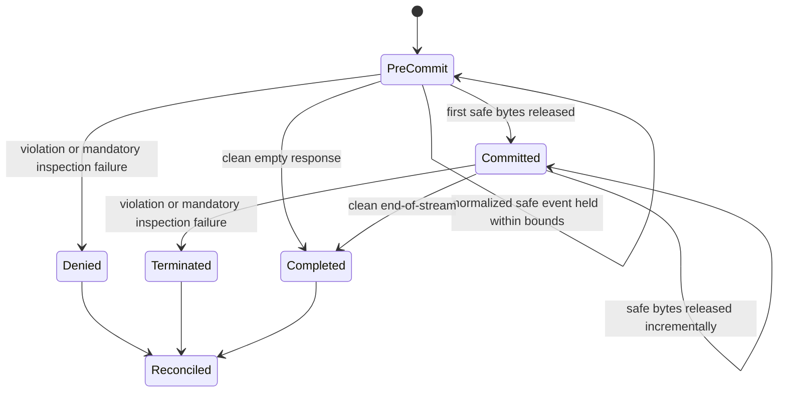

# Response and Stream Enforcement

## Scope and Status

This document records the Phase 2 response policy-enforcement point for unary,
SSE, and supported WebSocket output. Typed, classification-aware obligations
now drive coverage checks, masking, output bounds, pre-commit denial, and
post-commit termination without weakening affinity or no-mid-stream rotation.

## Current Production Evidence and Gaps

| Path | Current behavior | Remaining gap |
| --- | --- | --- |
| Buffered HTTP response | Successful bodies run typed inspection/masking and full-coverage/output-limit obligations before commit; denial is content-free and mandatory-audited when configured | Inspection remains bounded to supported response schemas and modalities |
| HTTP streaming response | A 4 KiB pre-commit hold enforces coverage/output obligations, then an incremental bounded inspector handles split matches and output limits | A violation after commit terminates the stream; already released safe bytes cannot be recalled |
| Provider-normalized SSE | OpenAI-compatible, Gemini, Copilot, Anthropic, Kiro, and passthrough paths share the governed stream wrapper | Structured tool-call semantics remain limited to the adapter's normalized emitted bytes |
| Generic Codex response under active inspection | Prodex-launched Codex uses a dedicated provider capability with `supports_websockets=false`, so response traffic enters the governed HTTPS/SSE path; a defensive direct WebSocket attempt records unsupported coverage in observe mode and is rejected before upgrade in enforce mode | Native upstream-to-client WebSocket frames remain transport-transparent, so non-Prodex clients in observe mode still have unsupported response coverage |
| Gemini Live WebSocket response | Client frames are classified/governed; translated server events use incremental output inspection and output-limit obligations, closing with a policy code on denial | Binary provider output remains unsupported inspection coverage |
| Usage reconciliation | Commit state is tracked at first delivery; post-commit policy termination is audited and cannot trigger provider rotation | The client observes transport termination rather than a replacement upstream error event |
| Audit | Pre-commit material denial uses durable governance audit in enforcing modes; post-commit events remain content-free and bounded | External SIEM outage behavior still depends on the selected deployment mode and outbox worker |

The stream guard detects configured literals across arbitrary read boundaries.
Its bounded pre-commit prefix can deny before any local byte is released;
violations discovered later are explicit post-commit termination and never
permit retry or rotation.

When response inspection is active, Prodex launches Codex with a dedicated
OpenAI-compatible provider that advertises `supports_websockets=false` and
points at the runtime proxy. This keeps auto-rotation and affinity in the proxy
while routing inspectable model output through HTTPS/SSE. A defensive direct
WebSocket attempt is observed as unsupported coverage or rejected with an
explicit HTTPS-fallback response according to rollout mode. Gemini Live remains
the translated governed WebSocket path. With inspection off, native OpenAI
WebSockets retain the transport-transparent runtime proxy behavior.

## Response Enforcement Contract

The response PEP consumes immutable request governance metadata plus a bounded
response obligation. It never queries policy, storage, Vault, SIEM, or provider
health on the stream path.

```rust
pub struct ResponseEnforcementPlan {
    pub policy_revision: PolicyRevisionId,
    pub detector_revision: DetectorRevisionId,
    pub classification: DataClassification,
    pub obligation: ResponseObligation,
    pub limits: ResponseInspectionLimits,
}

pub struct ResponseInspectionSummary {
    pub coverage: InspectionCoverage,
    pub classification: DataClassification,
    pub finding_kinds: BoundedFindingKindCounts,
    pub reason_codes: BoundedReasonCodes,
    pub inspected_bytes: u64,
}

pub enum ResponseEnforcementOutcome {
    Continue(ResponseInspectionSummary),
    DenyBeforeCommit(ResponseInspectionSummary),
    TerminateAfterCommit(ResponseInspectionSummary),
}
```

`ResponseInspectionSummary` contains no response text, raw match, arbitrary
field name, tool argument, filename, token, or provider credential.

The obligation must state whether response inspection is required, which
finding kinds are masked or denied, whether tool calls/results are inspected,
the permitted modalities, the maximum output, and the failure action for
partial or unsupported coverage. Masking is permitted only when the supported
schema and detector ranges make it structurally safe.

## Commit-Aware State Machine



`PreCommit` is local response commit, not merely receipt of an upstream status
or frame. Before commit, a violation returns a stable Prodex denial because no
upstream output has been exposed. After commit, the PEP stops further delivery,
cancels or closes the upstream transport as supported, reconciles partial
usage with a policy-interrupted reason, and emits mandatory content-free audit.
It does not retry, rotate profiles, select a fallback, or synthesize an
upstream quota/transport error.

## Unary Flow

```text
bounded provider body
-> provider adapter normalization
-> schema-aware response walk
-> typed detector composition
-> classification merge with request/session classification
-> response obligation evaluation
-> structure-preserving mask OR stable local denial OR release
-> usage reconciliation and audit
```

Unary enforcement has the entire bounded body before commit. Body overflow,
malformed supported output, unsupported required modality, detector timeout,
or invalid detector ranges lower coverage and follow the active failure mode.
They cannot silently become `Full`.

## Incremental SSE and WebSocket Algorithm

Transport fragments are first parsed into bounded provider events. Inspection
walks documented content fields in normalized events, not arbitrary SSE lines,
WebSocket framing bytes, or a stringified JSON object.

Each streaming detector publishes a finite maximum match span. Let
`holdback = max_match_span - 1`, capped by the active validated limits. The PEP
retains that many uncommitted content bytes so a finding split across chunks is
detected before its suffix is released.

```text
for each transport fragment:
    parse complete bounded events; retain bounded parser carry
    for each supported text/tool segment:
        combine prior detector tail + new segment
        inspect in deterministic detector order
        map findings to normalized segment ranges
        if a deny finding or required-inspection failure:
            deny before commit or terminate after commit
        apply safe masks wholly inside held bytes
        release only the safe prefix; retain declared holdback

on clean end:
    inspect final carry and held tail
    release it only if coverage and obligations pass
    reconcile completed usage
```

A detector without a finite maximum span cannot be used as an incremental
enforcement detector. Policy must choose one of three explicit alternatives:
buffer the entire response up to a finite unary limit, disable streaming for
that request, or deny/constrain execution. It must not pretend a fixed window
fully covers an unbounded pattern.

The implementation keeps independent bounded state for:

- transport/event parser carry;
- incomplete UTF-8 and escape sequences;
- detector lookbehind and normalized-text mapping;
- JSON nesting and partial tool/function arguments;
- finding, reason, event, and output counts;
- pre-commit bytes and maximum total inspected bytes;
- one deadline inherited from the request.

Unicode offsets are converted only within the exact inspected segment. Tests
cover multibyte code points, combining marks, normalization differences,
confusables, invalid UTF-8, and every split position of representative
findings. Normalization may add a risk signal but must not corrupt emitted
provider text.

## Tool Calls, Results, and Modalities

Tool and function arguments are inspected only through supported structured
fields. Arbitrary argument keys are not copied into logs, audit, or high-
cardinality metadata. A partial JSON argument is held until it is complete or a
bound/deadline fails.

Tool results entering a later model turn are request content and must pass the
same request inspection boundary. Tool calls leaving the model are response
content and follow the response obligation before local delivery or execution.

Images, audio, video, files, and binary WebSocket frames are `Partial` or
`Unsupported` unless an active real bounded adapter inspects that modality.
Metadata-only checks do not produce `Full` coverage. In enforcement modes,
policy must deny, constrain to an approved local path, or explicitly allow the
known coverage limitation.

## Failure Behavior

| Condition | Before first local commit | After first local commit |
| --- | --- | --- |
| Denied finding | Stable redacted local policy denial | Stop delivery, close/cancel safely, reconcile partial usage, audit `response_policy_interrupted` |
| Maskable finding | Apply a structure-preserving mask, then revalidate | Mask only bytes still held; otherwise terminate rather than retract exposed bytes |
| Malformed event or invalid range | Follow mode/obligation failure policy | Terminate in enforce modes when inspection is mandatory |
| Parser, byte, finding, or deadline limit | Coverage cannot be `Full`; deny if mandatory | Terminate if mandatory and reconcile as interrupted |
| Detector unavailable or timeout | Observe evidence or deny/constrain according to mode | Terminate if mandatory; never silently continue in bank mode |
| Client cancellation | Cancel upstream where supported and reconcile cancellation | Same; no policy retry or fallback |
| Audit append failure | Follow the mandatory-audit operation matrix | Never make a remote SIEM call; durable local failure behavior is mode-specific |

Mode policy is authoritative:

- `personal` with governance off preserves existing compatibility;
- `enterprise_observe` computes bounded shadow outcomes without weakening an
  existing denial;
- `enterprise_enforce` denies or constrains when required inspection cannot be
  proven;
- `bank_enforce` fails closed for required response inspection, unresolved
  classification, invalid mandatory snapshots, and unsupported sensitive
  output except an explicitly approved constrained local path.

## Audit, Metrics, and Errors

Mandatory response enforcement evidence includes request/trace correlation,
pseudonymous principal reference, canonical route/action, pre- or post-commit
state, coverage, classification, finding-kind counts, stable outcome/reason,
policy and detector revisions, provider ID when allowed, delivered byte/token
counts, and reconciliation reason.

It excludes response content, detector matches, exact locations, tool
arguments, arbitrary headers, provider errors containing content, tokens,
credentials, filenames, and full IP addresses.

Low-cardinality metrics cover inspection duration, coverage, outcome,
pre/post-commit violation, parser failure, limit/deadline failure, cancellation,
and reconciliation result. Tenant, principal, model, field path, detector
message, and arbitrary provider strings are not metric labels.

Local errors are stable and redacted. A pre-commit policy denial is identified
as a Prodex policy action. A post-commit termination uses natural stream close
or the existing protocol's safe terminal mechanism; it is never mislabeled as
an upstream `429`, quota exhaustion, or provider transport failure.

## Required Tests

### Current regression evidence

Existing focused tests verify that:

- active response inspection forces a runtime proxy even for a single profile;
- the governed Codex provider disables WebSockets and retains the proxy base URL;
- a buffered output keyword returns `403 policy_violation` before local body
  delivery;
- a streaming output keyword is not returned to the client;
- buffered and streaming keyword blocks create audit/runtime reason metadata;
- the configured token and matched keyword are absent from those logs;
- generic provider retry planning denies retry after first byte or
  cancellation; and
- stream accounting distinguishes completed, interrupted, and client-cancelled
  terminal reasons in its own state model.

These tests do not prove that a policy guard currently sends the interrupted
reason into reconciliation, nor do they cover typed response findings.

### Phase 2 matrix

Add table-driven coverage across:

- unary, SSE, generic WebSocket, and Gemini Live WebSocket paths;
- all four classifications and all three coverage states;
- response inspection off, observe, and enforce;
- local and remote providers;
- tools disabled, allow-listed, malformed, and split across frames;
- safe pass, safe mask, pre-commit denial, post-commit termination, client
  cancellation, provider failure, and deadline expiry;
- personal, enterprise observe, enterprise enforce, and bank enforce modes.

Property/fuzz tests must split every representative finding, UTF-8 sequence,
escape, SSE delimiter, JSON token, and WebSocket event at every relevant chunk
boundary. They must also cover malformed chunks, deep JSON, event floods,
finding floods, huge strings, normalization/confusable cases, detector range
errors, and parser state limits.

Integration assertions must prove:

1. no violating held bytes reach the client;
2. no retry, profile rotation, or fallback occurs after commit;
3. a policy stop reconciles delivered usage exactly once as interrupted;
4. audit contains revisions and stable reasons but no source content;
5. unsupported modalities never report `Full` coverage; and
6. disabling governance preserves accepted personal-mode streaming behavior.

## Exit Gate

The response-enforcement exit gate is not met. It requires all supported
provider response paths to use one typed PEP with an immutable response
obligation, explicit coverage and classification, bounded normalized parsing,
correct pre-commit denial, correct post-commit termination and accounting,
mandatory content-free audit, and passing unary/SSE/WebSocket mode matrices.

The keyword-only wrappers may remain as compatibility inputs during observe
rollout, but they cannot remain a second authoritative response policy after
the typed PEP is enforced.
