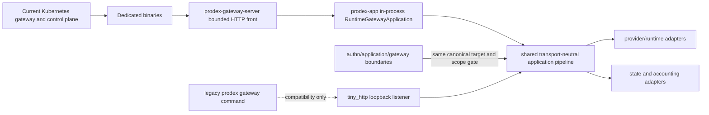
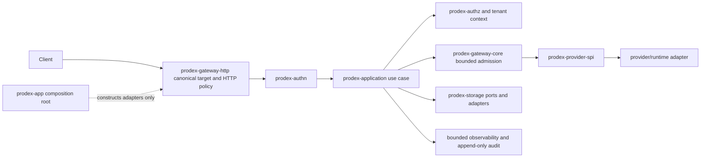

# Target Architecture and Migration Slices

## Scope

This is a strangler migration. Compatibility adapters remain callable until one complete vertical
slice has characterization parity, production wiring, and deletion evidence. No big-bang rewrite
or transport redesign is part of the migration.

## Current Production Shape



Current risks:

- secret verification, principal construction, authorization, admission, accounting, routing, and
  provider policy remain split between boundary crates and compatibility code;
- `prodex-app` still owns policy decisions that should live in domain/application boundaries;
- the legacy root `prodex gateway` command retains its Tiny listener for CLI compatibility, while
  dedicated production binaries use only the bounded in-process transport.

## Target Production Shape



One immutable `RequestContext` carries request ID, canonical target/route, plane, validated
principal and tenant context, deadline, trace context, and redacted metadata. It does not own
mutable global state or raw secrets.

## Dependency Rules

1. Domain types depend on no HTTP, process, provider, or concrete storage adapter.
2. `prodex-authn` validates cached identity material; request authentication performs no network
   I/O.
3. `prodex-gateway-http` parses one `CanonicalRequestTarget` and applies HTTP-only policy.
4. `prodex-application` orchestrates use cases and depends on ports, not concrete network or
   database implementations.
5. `prodex-provider-spi` accepts validated invocation plans and `SecretRef`, not raw policy input.
6. Concrete provider, HTTP, process, and storage adapters point inward toward ports.
7. `prodex-app` and binaries are composition roots. They may launch processes and bind adapters,
   but may not duplicate auth, authz, admission, accounting, or routing policy.
8. No new crate cycle, reverse domain dependency, or one-implementation trait is allowed.

## Canonical Request Lifecycle

```text
parse and validate request target
-> classify explicit route and plane
-> construct request context
-> authenticate from immutable cache state
-> authorize principal and tenant scope
-> validate headers and bounded body policy
-> acquire bounded lane/profile admission
-> plan and dispatch provider or control use case
-> commit or reconcile accounting
-> map response without redefining upstream failures
-> emit bounded redacted telemetry and audit
```

## Migration Slices

| Slice | Characterization before enablement | Production cutover evidence | Legacy deletion condition |
| --- | --- | --- | --- |
| Canonical target and plane | route corpus, ambiguous-target negatives, front/backend differential tests | front passes the same typed target used for policy and forwarding | no second path parser/classifier remains |
| Authentication and scope | current virtual-key/admin/OIDC behavior; cross-scope negatives | production constructs validated claims and calls application auth boundary | compatibility auth policy has no production callers |
| Authorization and tenant | cross-tenant and role matrices | canonical principal/tenant context reaches each use case | ad hoc role/tenant branches removed |
| Admission/reservation | lane caps, quota, retry-before-commit, cancellation | bounded admission and durable reservation plans execute in production | legacy admission/accounting planner removed |
| Provider invocation | provider fixtures, streaming order, upgrades, upstream error pass-through, affinity | SPI adapters receive validated invocation plans | duplicate provider policy removed from `prodex-app` |
| Reconciliation/audit | completed/cancelled/interrupted streams and idempotent ledger writes | every exit reconciles reservation and emits bounded audit | legacy accounting/audit side effects removed |
| Control mutations | authz, idempotency, precondition, audit, tenant isolation | application use cases own real storage mutation | legacy admin execution branches removed |

## Implemented Slices

- The async front and deployed legacy root both reject ambiguous or unknown targets before backend,
  authentication, accounting, or provider work. Static route aliases are tested against their
  canonical kind and plane, and backend provider classification reuses the shared classifier.
- Production legacy traffic now constructs a non-forgeable `ApplicationRequestContext` from the
  exact canonical target. Verified legacy data/admin outcomes enter `prodex-application` and
  `prodex-authn` as an authoritative scope gate before admission or use-case execution. ADR 1072
  owns the compatibility adapter and its deletion conditions.
- Dedicated data-plane and control-plane binaries now move the async front's exact
  `CanonicalRequestTarget` into one listener-free `RuntimeGatewayApplication`. Bounded request and
  body channels preserve streaming backpressure, cancellation, overload, drain, and Gemini Live
  upgrade semantics without a front-to-loopback socket hop. ADR 1075 owns this transport cutover.
- Two uncompiled duplicate request-entry/authentication prototypes were removed. Credential
  decoding, principal/tenant construction, authz, durable admission, provider invocation, and
  reconciliation remain explicit later slices.
- Navigability work preserved flat APIs while splitting `prodex-observability` into nine owned
  signal modules and domain audit into event, query, retention, and error modules. Their facades
  are now 30 and 13 lines respectively; no function body or dependency direction changed.
- `prodex-application` is now a 165-line facade over authentication, identity/access, data-plane,
  accounting, control-plane, configuration/runtime, and provider modules. Its 306 public names and
  205 derive contracts remain unchanged, and the production request-context gate remains a
  first-class re-export.
- The adapter-neutral storage boundary is now a 37-line facade over topology, accounting, audit,
  identity, policy, secret-reference, idempotency, and multi-replica verification modules.
  `prodex-gateway-http` is a 43-line facade over canonical request targets, HTTP request policy,
  routing, preconditions, execution planning, API versions, and upstream-header policy.
- API and security observability families split their contracts from pure metric planners so every
  production module stays below the repository size guard. Workspace-inherited lints now reject
  implicit unsafe operations and development-only `dbg!`, `todo!`, or `unimplemented!`
  placeholders in every workspace crate.

## Compatibility Matrix

| Contract | Protecting evidence |
| --- | --- |
| CLI flags, aliases, exit status, human/JSON output | CLI parser/default-run tests and command integration snapshots |
| Responses and compact HTTP behavior | runtime proxy/gateway characterization tests |
| WebSocket upgrade and byte order | gateway server upgrade tests and runtime WebSocket tests |
| SSE event order and first-commit boundary | provider fixtures and runtime stream tests |
| `previous_response_id`, turn-state, and session affinity | runtime affinity and compact-session tests |
| Retry/rotation only before commit | runtime quota, overload, and transport-backoff tests |
| Upstream status/body/stream pass-through | compatibility replay and gateway/provider tests |
| Header preservation and auth replacement | runtime proxy header tests |
| Quota screen behavior | quota integration tests using `--once` for snapshots |
| Persisted profile/runtime/accounting formats | store merge, compaction, import, and migration tests |
| Graceful shutdown and bounded work | gateway/runtime drain, saturation, timeout, and flood tests |

## Reversibility

Each slice keeps its compatibility adapter until parity passes. Feature flags are not added by
default; a temporary selector is justified only when rollback cannot be achieved by reverting one
cohesive commit. Behavior tests ship in the same commit as each changed slice.

## Production Cutover Gate

The deployment points at the dedicated async front after route, auth, accounting, provider,
streaming, upgrade, cancellation, drain, and credential-separation characterization tests pass.
Architecture guards reject both restoration of a dedicated loopback backend and production
data/control handlers that bypass the application authentication/use-case boundary.
